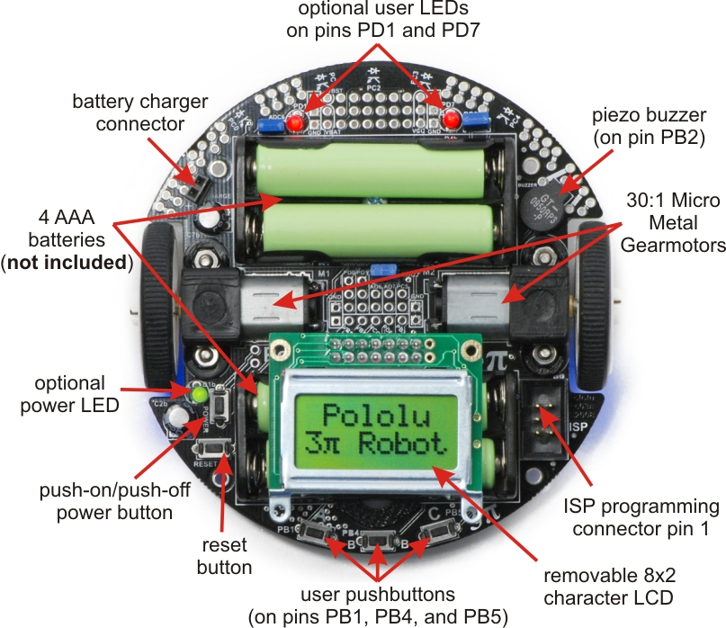
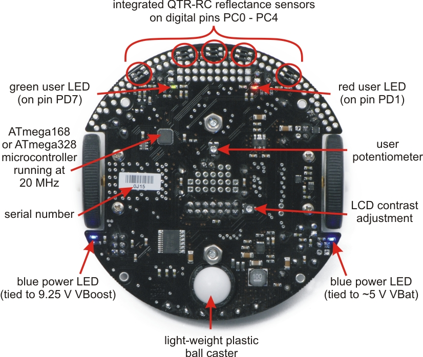

# Polulu Robot 3Pi Navigation Project

## Overview
This project utilizes the Polulu 3Pi Robot to control its movements while navigating through an x-y coordinate axis. Coordinates for the x and y axes are entered through a series of button presses on the left and right buttons, respectively. The applications used for this project include the installation of a coding editor (I used Visual Studio Code), as well as any terminal application (Visual Studio Code has a built-in terminal). During the creation of this project, we encountered challenges related to minimizing the error between the real destination of the robot and its intended destination. This challenge was overcome through multiple testing rounds where a mathematical expression was derived to calculate the numerical value that would most closely match the intended destination of the robot.

## How to Install
Download the code from Github and open it in your preferred code editor (e.g. Visual Studio Code)
Insert four AAA batteries into the Polulu 3Pi Robot and attach the LCD display.
Connect your robot to a USB AVR Programmer using a 6-pin ISP programming cable.
Connect the USB AVR Programmer to a laptop or computer using a mini-B to USB A cord.
Turn on the robot by pressing the power button located on the left side of the LCD display.
Run the provided makefile and wait until the robot is fully programmed before disconnecting the 6-pin ISP cable from the robot.
Input an x-axis value by pressing the left button and do the same for the y-axis using the right button. (Note that the LCD will display an initial value of -30 for both x and y and will increment by a value of 1 with each button press).
Ensure the robot is placed flat on a hard surface with no obstacles nearby before pressing the middle button to set the coordinates.
Wait until the robot has stopped before picking it up. You can restart the process using the rest button or turn it off using the power button. Good luck!

## Visual Aid

  
  

A top and bottom view of the Polulu Robot 3Pi. Images were taken from https://www.pololu.com/product/975

## Credits
- Partner: [Christopher Ghim](https://www.linkedin.com/in/christopher-ghim-bb1218223/)
- [Description of Polulu Robot 3Pi Functions](https://www.pololu.com/product/975)

- Purchase Links are shown here:
  - [Polulu 3Pi](https://www.bananarobotics.com/shop/Pololu-3pi-Robot)
  - [Polulu USB AVR Programmer](https://www.pololu.com/product/1300)
  - [USB Cable A to Mini-B, 5ft](https://www.pololu.com/product/1315)
  - [6-Conductor Ribbon Cable with IDC Connector 12"](https://www.pololu.com/product/972)
